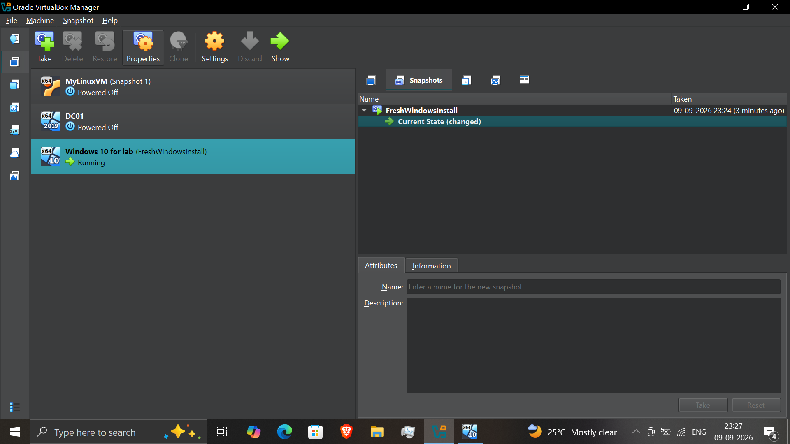
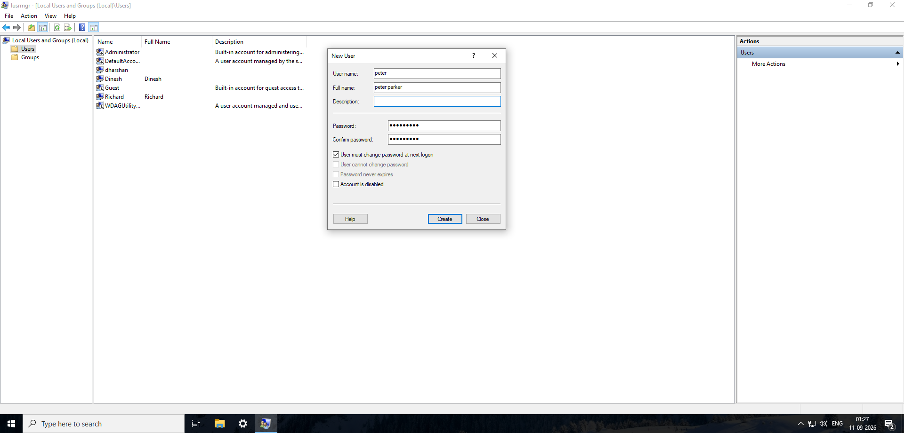
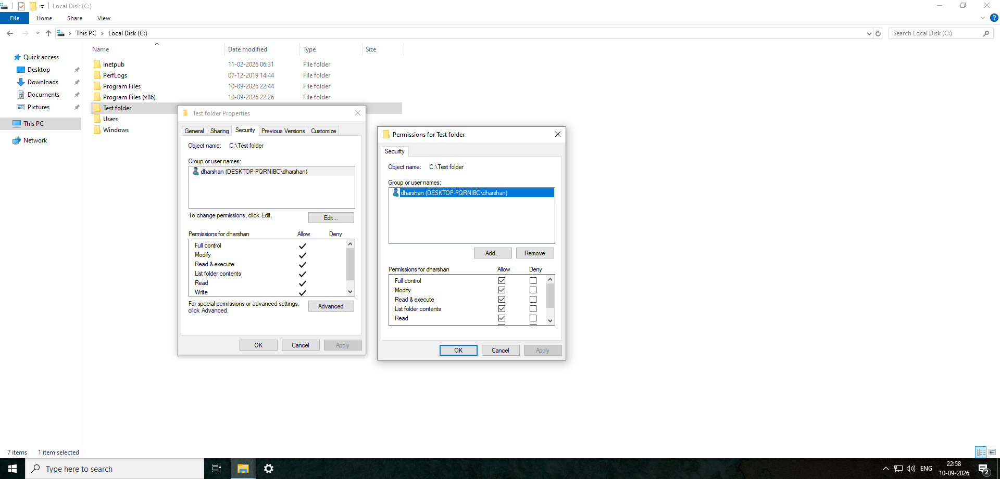
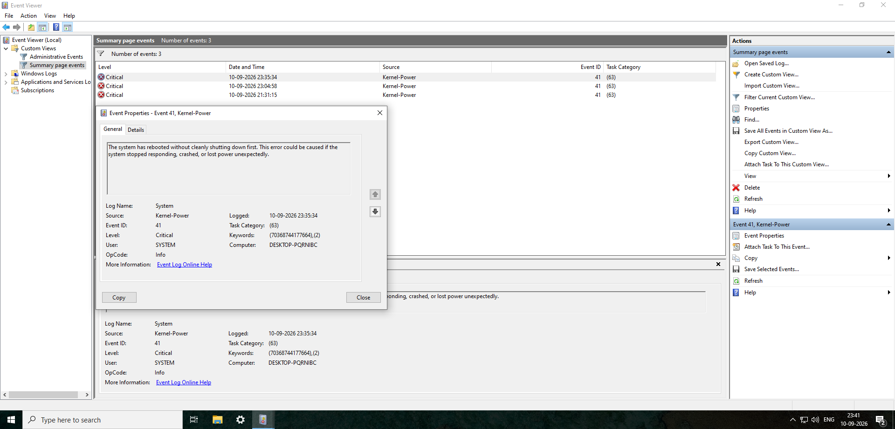
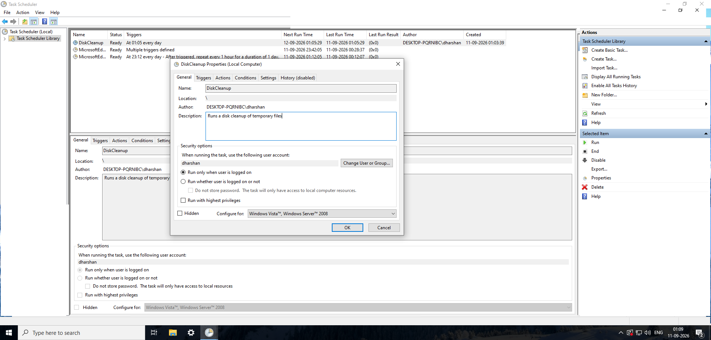

# Windows Administration & Virtualization Lab

## Objective
Practice core Windows 10/11 administration tasks a help desk technician handles daily: user account creation, file permission management, safe change-testing via VM snapshots, event log diagnosis, and task automation.

## Environment / Tools
- Oracle VirtualBox Manager
- Windows 10/11 VM ("Windows 10 for lab")
- Windows built-in tools: Local Users and Groups (lusrmgr.msc), File Explorer Security tab, Event Viewer, Task Scheduler

## What I Did
1. **VM snapshot management** — Took a snapshot named `FreshWindowsInstall` of the lab VM before making any changes, so I could roll back to a clean state if something broke.
2. **Local user account creation** — Created a new local user account (`peter`, full name "peter parker") via Local Users and Groups, with "User must change password at next logon" enabled to simulate a real onboarding ticket.
3. **File permission configuration** — Created `C:\Test folder` and configured NTFS permissions through the Security tab, granting Full Control, Modify, Read & Execute, List Folder Contents, Read, and Write to a specific local user.
4. **Event Viewer diagnosis** — Reviewed the System log's Summary page and inspected a Critical-level Event ID 41 (Kernel-Power), which logs an unclean shutdown/reboot — read the event detail to understand what triggers it and what it implies for troubleshooting.
5. **Task automation** — Reviewed and configured a scheduled task (`DiskCleanup`) in Task Scheduler, including its trigger schedule, run-as account, and security options (run only when logged on vs. run whether logged on or not).

## Problems I Ran Into
- The VM's Current State showed as "changed" relative to the `FreshWindowsInstall` snapshot after making edits — this is expected VirtualBox behavior, but it clarified for me how snapshot rollback actually works: the snapshot preserves the exact prior state, and any further changes just modify the "current state" branch until I explicitly restore.
- Event ID 41 (Kernel-Power) initially looked alarming as a "Critical" event, but reading the event detail showed it specifically flags unclean shutdowns (crash, power loss, or forced restart) rather than an application error — an important distinction when triaging which System log entries actually need follow-up.

## Screenshots

*VirtualBox Snapshots view showing the `FreshWindowsInstall` snapshot and the current running state of the lab VM.*

*Creating a new local user account via Local Users and Groups, with "change password at next logon" enforced.*

*NTFS permissions configured on `C:\Test folder` for a specific local user via the Security tab.*

*Event Viewer Summary page showing a Critical Kernel-Power event (ID 41), with the event detail explaining it flags an unclean shutdown.*

*DiskCleanup scheduled task showing its trigger schedule and run-as security options.*

## What This Demonstrates
Demonstrates the account provisioning, permission configuration, safe change-testing, and log-based troubleshooting an L1 technician handles on a daily basis — plus the judgment to correctly interpret what a "Critical" log entry actually means before escalating it.
