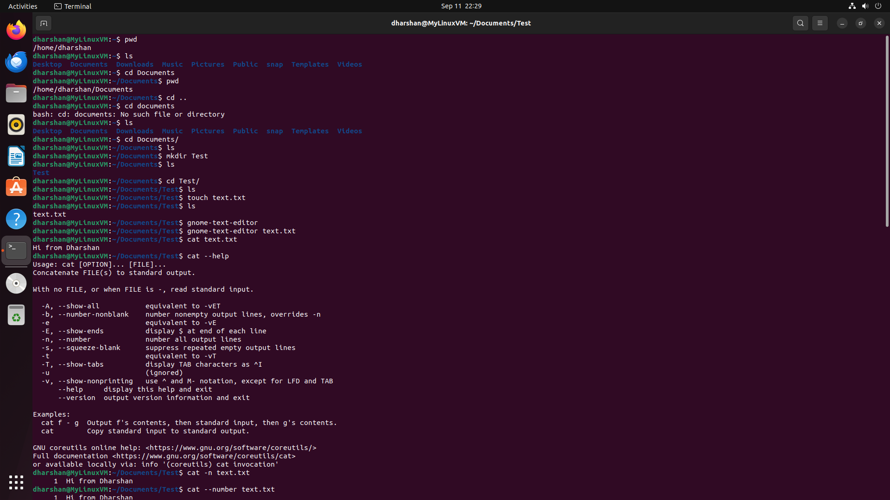
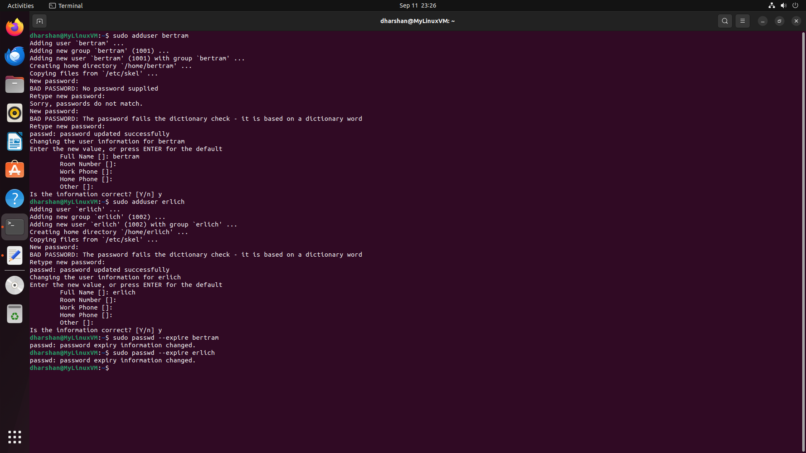
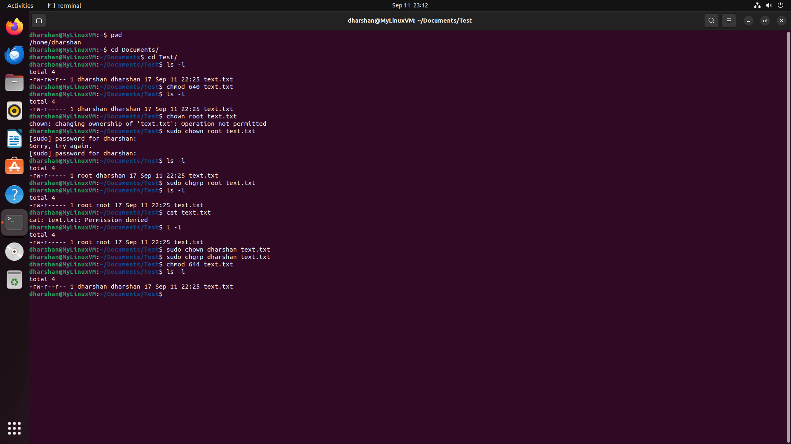
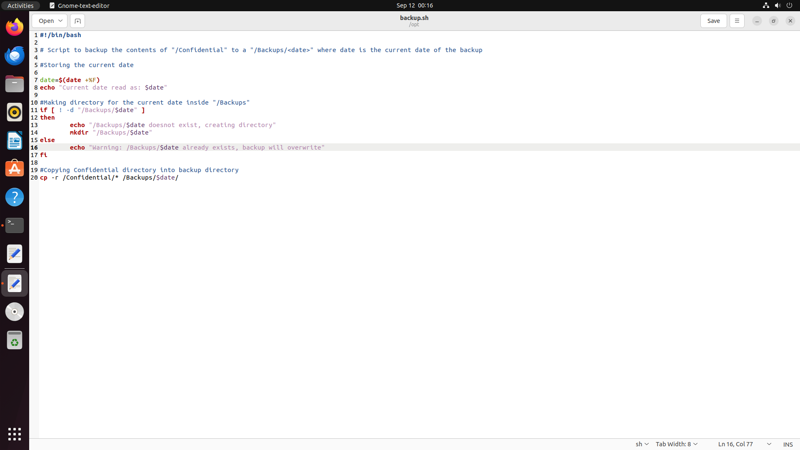
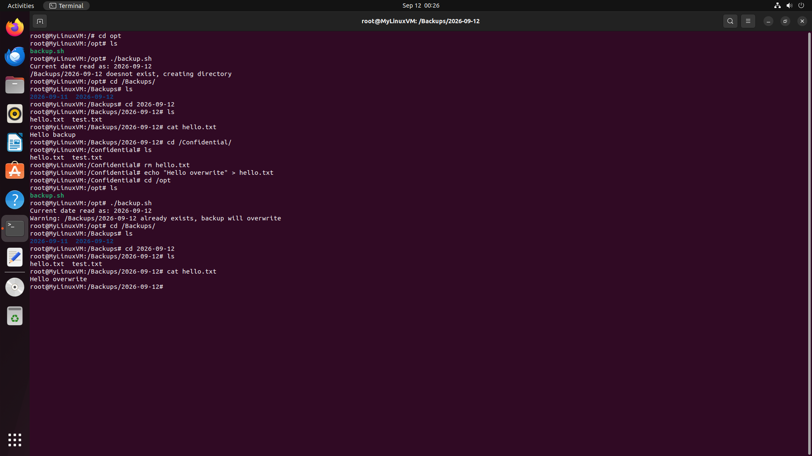
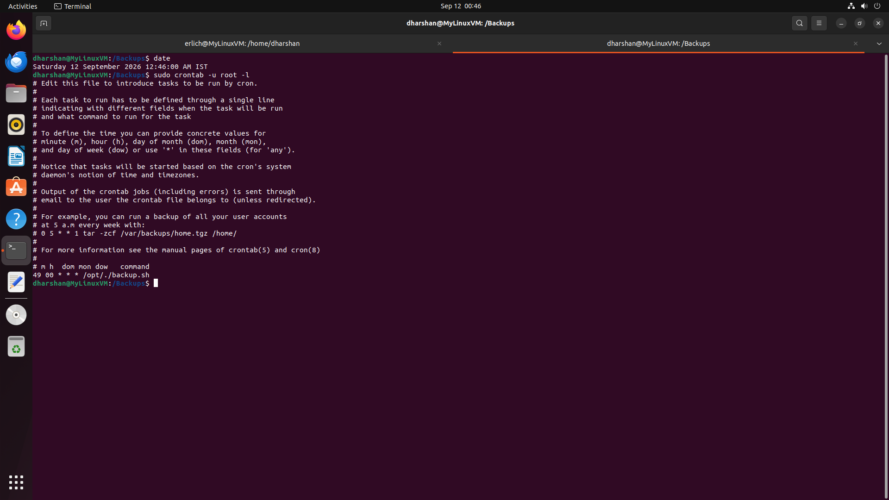
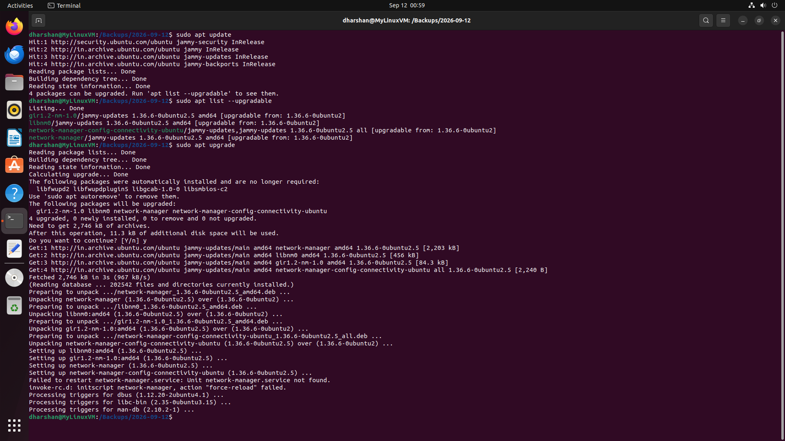
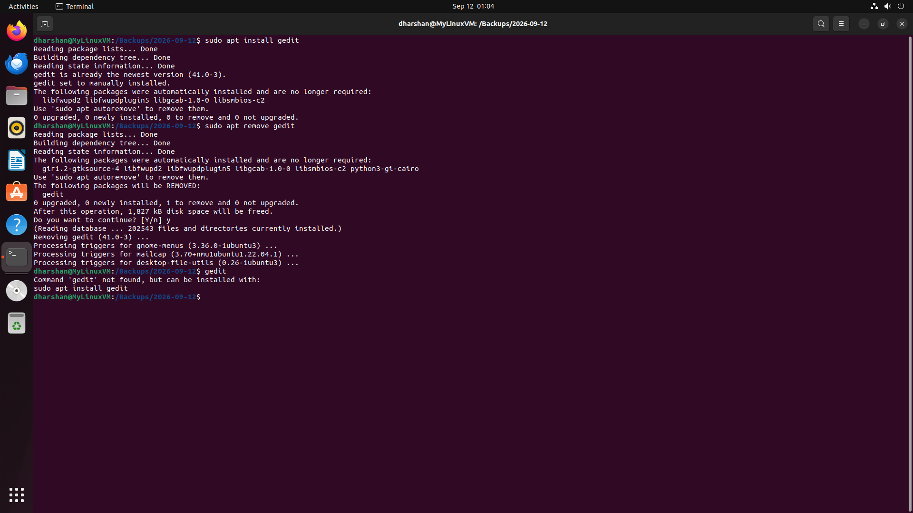
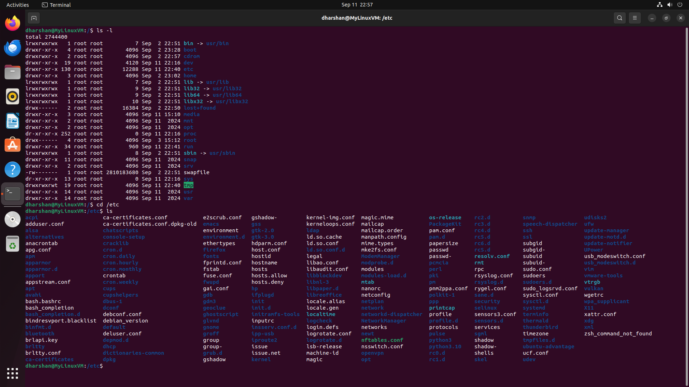
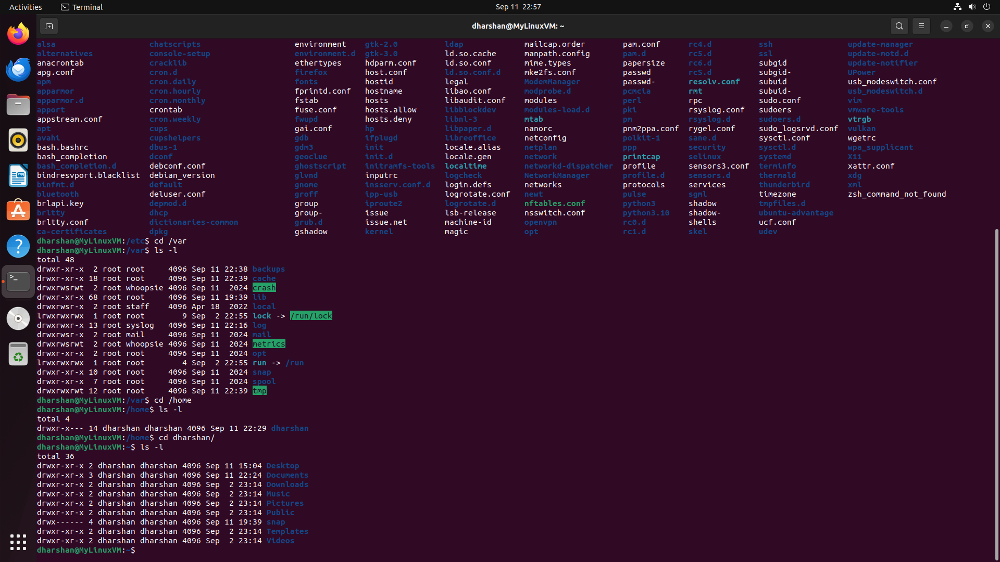

# Linux System Administration Lab

## Objective
Practice core Linux administration tasks a help desk technician handles daily: navigating the filesystem, managing users and permissions, automating tasks with Bash and cron, and using the package manager to install, update, and remove software.

## Environment / Tools
- Ubuntu Linux VM ("MyLinuxVM") running in VirtualBox
- GNOME Terminal, gnome-text-editor
- apt package manager

## What I Did
1. **Terminal navigation & file basics** — Practiced `pwd`, `ls`, `cd`, `mkdir`, and `touch` to move around the filesystem and create test files/folders; used `cat`, `cat -n`, and `cat --help` to view file contents and explore command options.
2. **User account creation & password policy** — Created two new users (`bertram`, `erlich`) with `sudo adduser`, then used `sudo passwd --expire` on both accounts to force a password reset at next login — the standard way an admin enforces a policy change across accounts without disabling them.
3. **File ownership & permissions** — Set explicit permission bits with `chmod 640` and `chmod 644` on a test file, then walked through changing ownership with `chown` and group with `chgrp`, observing how Linux enforces who is allowed to make those changes.
4. **Bash scripting** — Wrote `backup.sh`, a script that reads the current date, checks whether a dated backup folder already exists under `/Backups`, creates it if not (or warns before overwriting if it does), and copies the contents of `/Confidential` into it.
5. **Script execution & verification** — Ran the backup script as root, confirmed the backup folder and file contents were created correctly, then modified the source file and re-ran the script to confirm the overwrite-warning logic worked as intended.
6. **Cron scheduling** — Scheduled `backup.sh` to run automatically via root's crontab, setting a specific daily time (`49 00 * * *`) and verified the job with `crontab -l`.
7. **Package management** — Ran `sudo apt update` and `apt list --upgradable` to check for available updates, then `sudo apt upgrade` to apply them.
8. **Installing & removing software** — Installed and then removed a package (`gedit`) with `sudo apt install` / `sudo apt remove`, confirming the removal by trying to run the command afterward and getting a "not found" response.
9. **Filesystem hierarchy exploration** — Navigated and listed the contents of `/`, `/etc`, `/var`, and `/home` to understand the standard Linux directory structure and typical ownership/permission patterns at each level.

## Problems I Ran Into
- Typed `cd documents` (lowercase) and got `No such file or directory` — a reminder that Linux paths are case-sensitive, unlike Windows.
- Tried `chown root text.txt` without `sudo` first and got `Operation not permitted` — confirmed that only root (or a user with sudo rights) can change file ownership, not just the file's current owner.
- Mistyped the sudo password once (`Sorry, try again`) before it accepted — a small but real reminder that terminal password prompts show no characters at all, including no asterisks.
- Running the backup script a second time on the same day correctly triggered the "already exists, backup will overwrite" warning instead of silently overwriting or failing — validated that the script's date-check logic worked as designed rather than assuming it from the code alone.

## Screenshots

*Basic navigation and file commands: `pwd`, `ls`, `cd`, `mkdir`, `touch`, and `cat` (including `cat -n` and `cat --help`).*

*Creating two new users with `sudo adduser` and forcing a password reset at next login with `sudo passwd --expire`.*

*Setting permission bits with `chmod`, and changing ownership/group with `chown`/`chgrp` — including the "Operation not permitted" error before using `sudo`.*

*`backup.sh` open in the text editor: date-stamped backup folder logic with an overwrite warning.*

*Running `backup.sh`, confirming the backup folder and file contents, then re-running it to trigger the overwrite warning.*

*Root's crontab showing `backup.sh` scheduled to run automatically once daily.*

*Checking for and applying available package updates with `apt update`, `apt list --upgradable`, and `apt upgrade`.*

*Installing and then removing `gedit`, confirming the removal by attempting to run the command afterward.*

*Listing the root directory (`/`) and exploring `/etc`, showing the standard top-level Linux directory structure.*

*Exploring `/var` and `/home`, including per-user home directory permissions.*

## What This Demonstrates
Demonstrates the day-to-day Linux administration skills an L1/L2 technician relies on: user provisioning and password policy enforcement, ownership/permission troubleshooting, writing and validating automation scripts, scheduling recurring jobs, and safely managing installed software — all backed by real command output rather than a rehearsed walkthrough.
