# Networking & Remote Support Lab

## Objective
Practice core networking and remote-support tasks a help desk technician handles daily: router/DHCP configuration, IP addressing, connectivity diagnostics, DNS resolution, VPN setup, and remote access via SSH, RDP, and VNC.

## Environment / Tools
- TP-Link TL-WR841N Router Emulator (official TP-Link web emulator)
- Windows 10 (Command Prompt), Ubuntu Linux VM (GNOME Terminal)
- OpenVPN Connect
- Remote Desktop Connection (RDP), SSH, VNC Viewer

## What I Did
1. **Router configuration (DHCP)** — Configured the DHCP server on a TP-Link router emulator: enabled the server, set the IP address pool range, lease time, and default gateway.
2. **Router configuration (LAN & subnet)** — Reviewed LAN settings showing the router's IP address and subnet mask, confirming the network's addressing scheme.
3. **Router configuration (wireless security)** — Configured wireless security using WPA/WPA2-Personal with AES encryption and a wireless password, reviewing the alternative security options (Enterprise/RADIUS, WEP) along the way.
4. **IP configuration** — Checked local IP configuration with `ipconfig`, identifying the IPv4 address, subnet mask, and default gateway.
5. **Connectivity testing** — Used `ping google.com` to confirm connectivity and measure round-trip time and packet loss.
6. **DNS resolution** — Used `nslookup www.google.com` to resolve a domain to its IP addresses, then verified resolution end-to-end by pasting one of the returned IPs directly into a browser to confirm it reached the site.
7. **Network mapping (ARP)** — Used `arp -a` to view the local ARP table, mapping IP addresses on the network to their physical (MAC) addresses.
8. **VPN connection** — Connected via OpenVPN Connect, confirming the tunnel was active and reviewing the assigned VPN IP alongside real-time upload/download stats.
9. **Port/connection inspection (bonus)** — Used `netstat -tulpna` on the Linux VM to list active listening ports and established connections, identifying which processes owned each connection.
10. **Remote access — SSH** — Connected from Windows to the Linux VM via `ssh dharshan@<ip>`, verifying the host key fingerprint on first connection before authenticating.
11. **Remote access — RDP** — Connected to a Windows VM using Remote Desktop Connection, confirming a live remote session.
12. **Remote access — VNC** — Connected to a Windows VM using a VNC viewer, confirming a live remote session over a different remote-access protocol than RDP.

## Problems I Ran Into
- On the first SSH connection, Git/OpenSSH flagged that the host's authenticity couldn't be established and displayed the ED25519 key fingerprint, requiring explicit confirmation before proceeding — a direct, hands-on look at SSH's trust-on-first-use model rather than just reading about it.
- Confirming DNS resolution wasn't just about running `nslookup` and reading the output — pasting one of the resolved IPs into the browser was the extra step that proved the resolution was actually correct and reachable, not just returning *an* answer.

## Screenshots
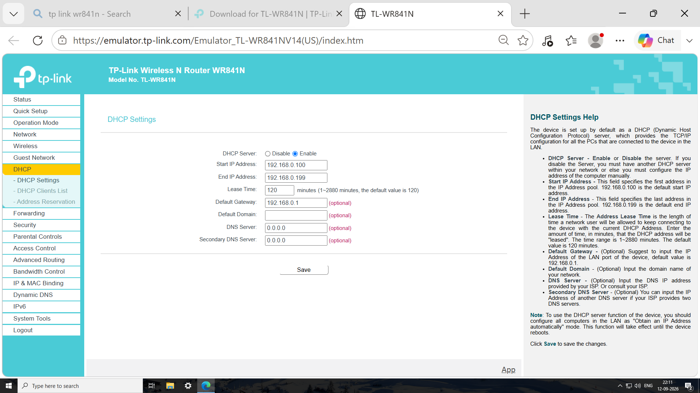
*TP-Link router emulator: DHCP server enabled with a configured IP address pool, lease time, and default gateway.*

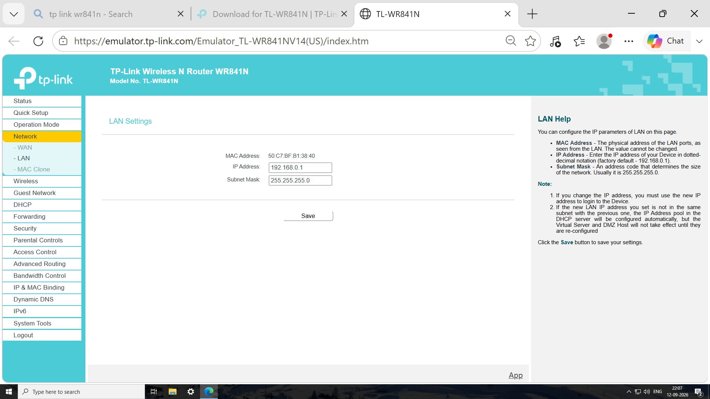
*Router's LAN IP address and subnet mask, defining the network's addressing scheme.*

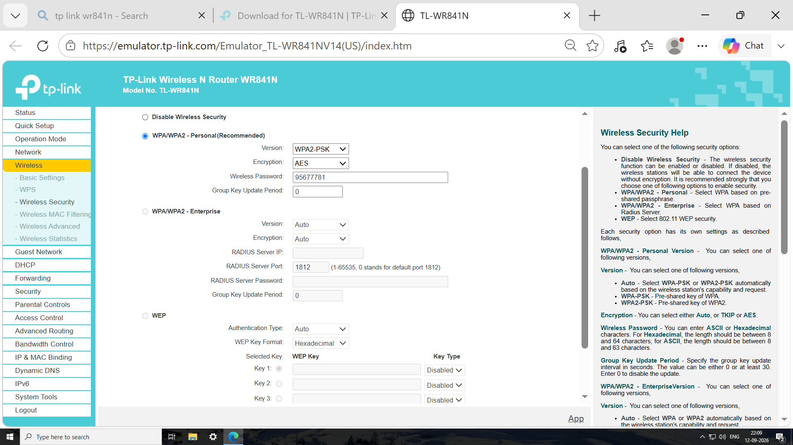
*Wireless security configured with WPA/WPA2-Personal and AES encryption.*

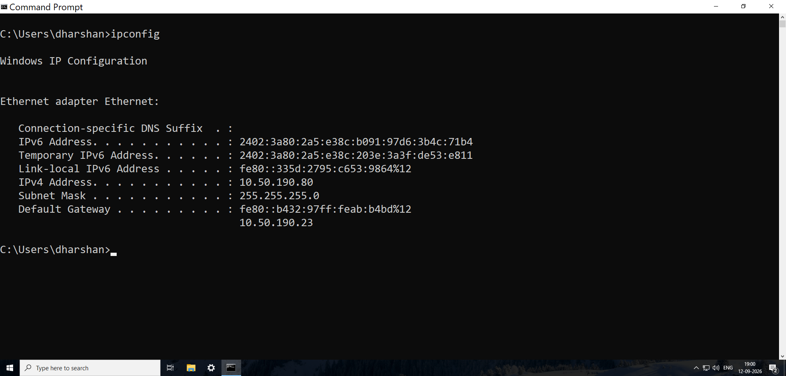
*`ipconfig` output showing the assigned IPv4 address, subnet mask, and default gateway.*

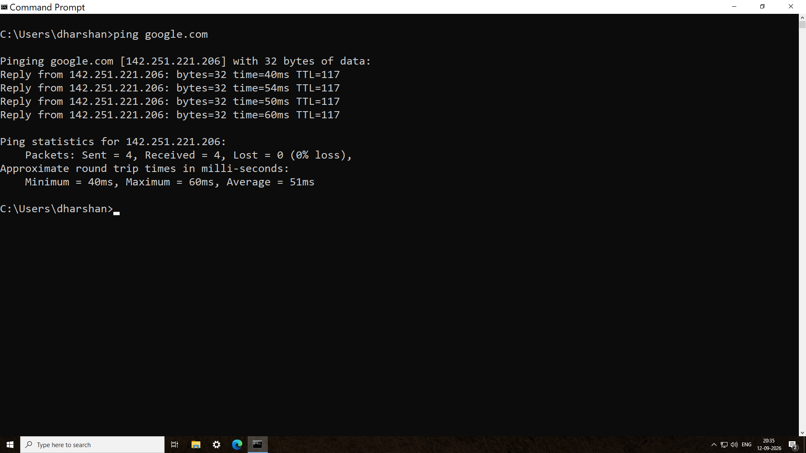
*`ping google.com` confirming connectivity with 0% packet loss and round-trip time statistics.*

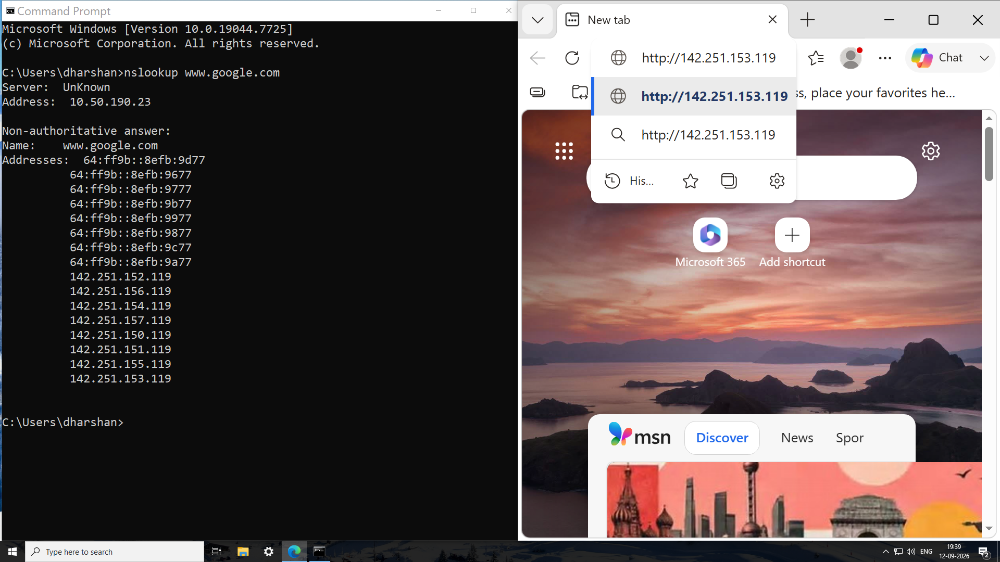
*`nslookup www.google.com` resolving the domain to its IP addresses, verified further by loading one of the IPs directly in a browser.*

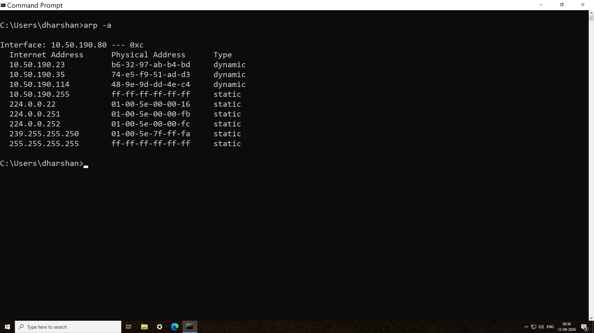
*`arp -a` output mapping local network IP addresses to their physical MAC addresses.*

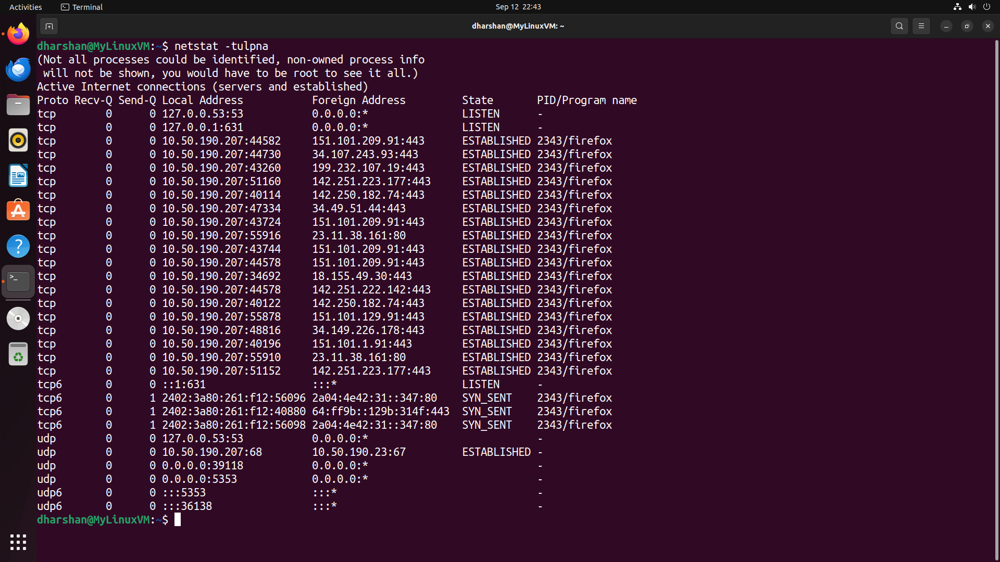
*`netstat -tulpna` listing active listening ports and established connections with their owning processes.*

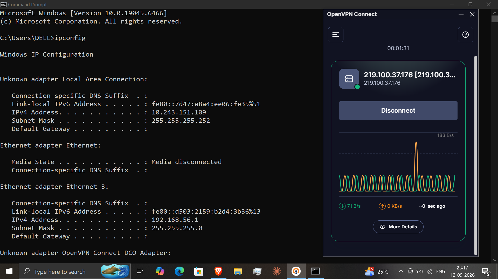
*OpenVPN Connect showing an active tunnel, assigned VPN IP, and live traffic stats.*

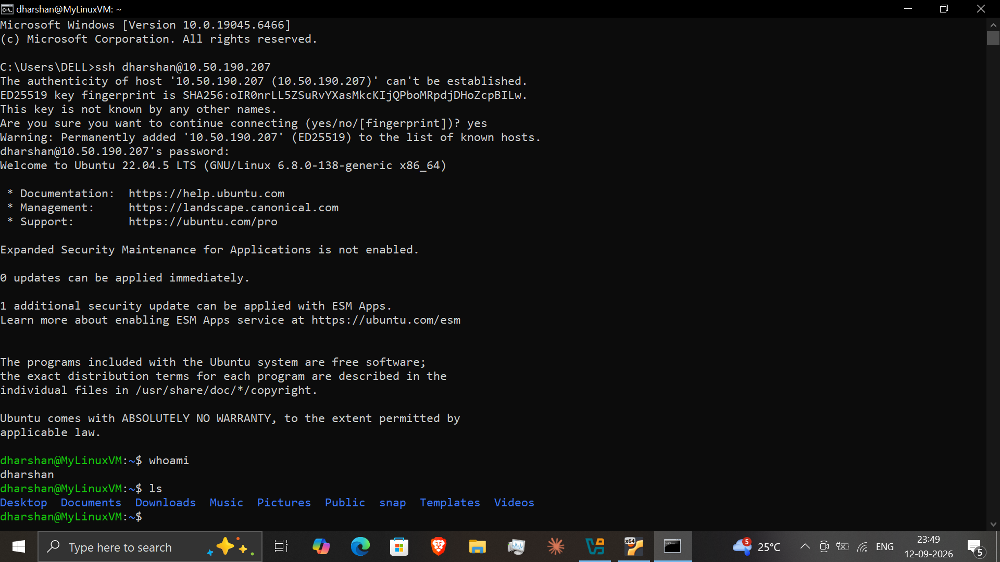
*Successful SSH login from Windows into the Ubuntu Linux VM, including host key fingerprint verification.*

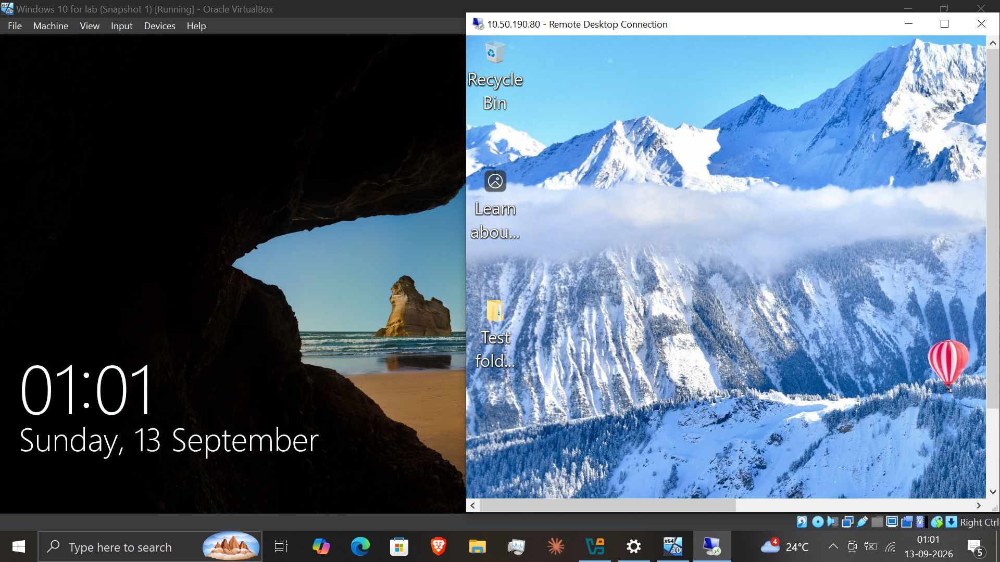
*Active Remote Desktop session connected to a Windows VM.*

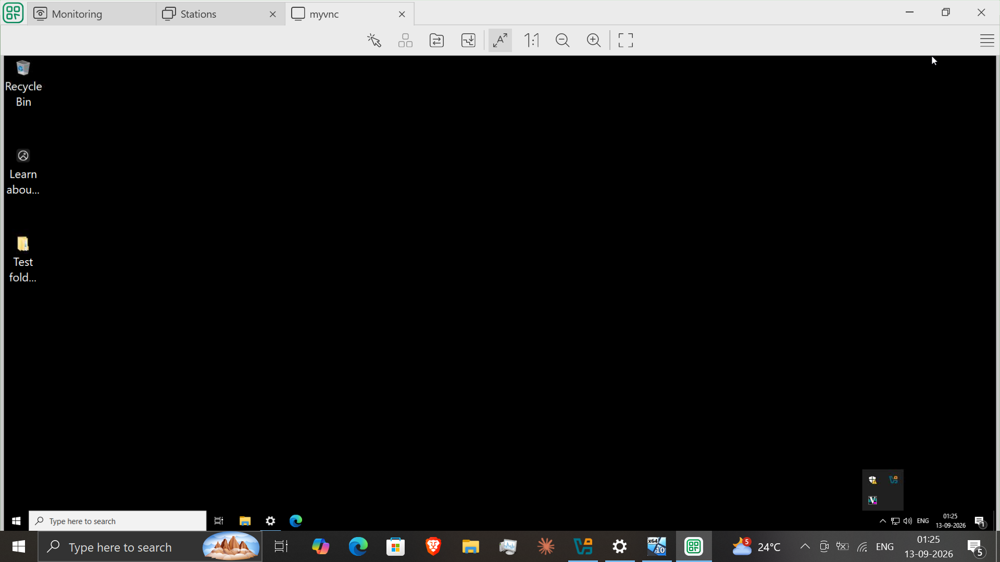
*Active VNC session connected to a Windows VM over a separate remote-access protocol.*

## What This Demonstrates
Demonstrates the networking and remote-support fundamentals an L1/L2 technician relies on daily: configuring router/DHCP/wireless settings, diagnosing connectivity and DNS issues, mapping a local network, establishing secure remote access over multiple protocols (SSH, RDP, VNC), and verifying results rather than assuming a command's output is correct at face value.
