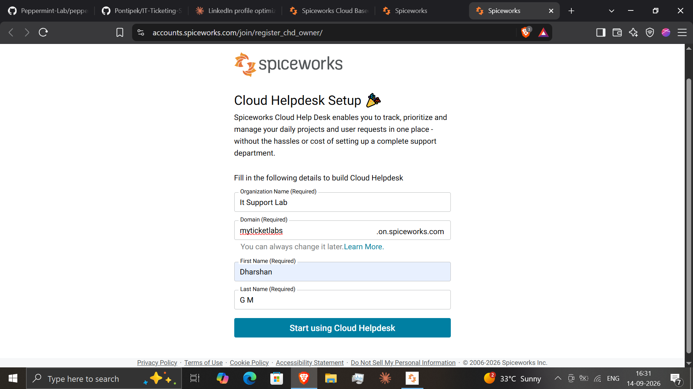
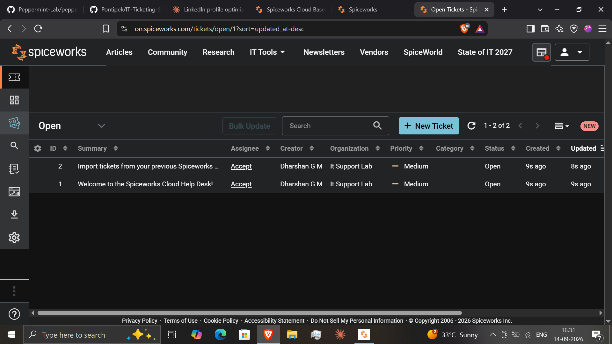
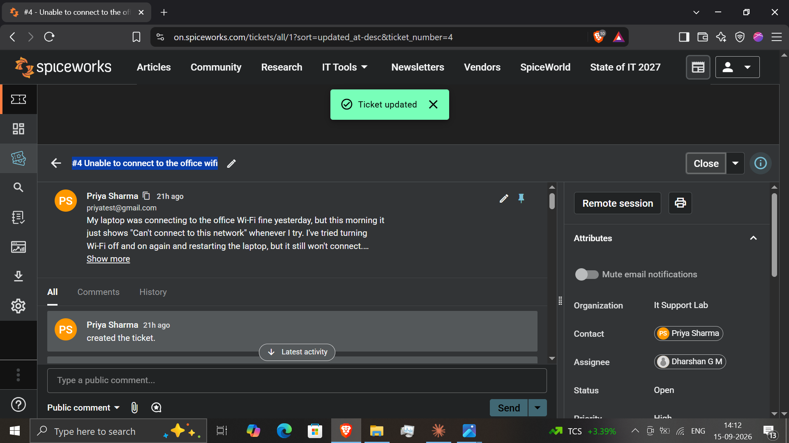
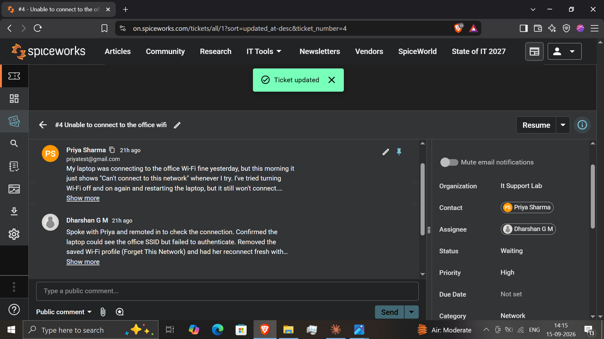
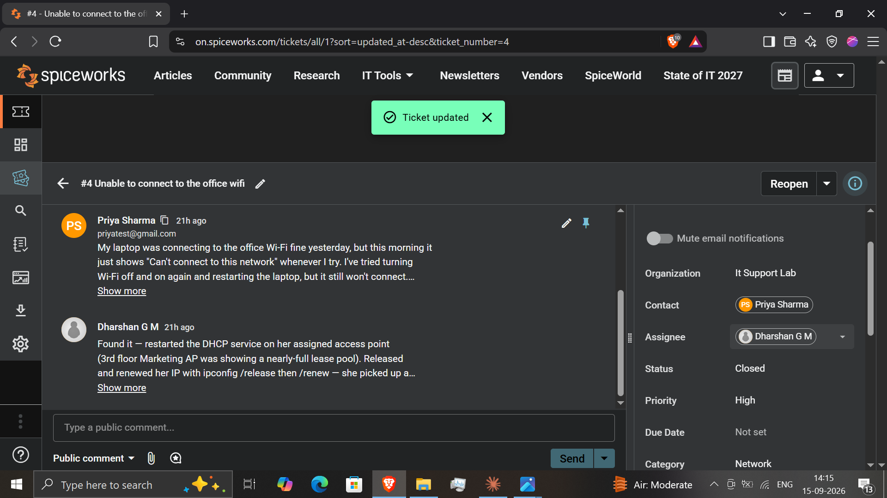
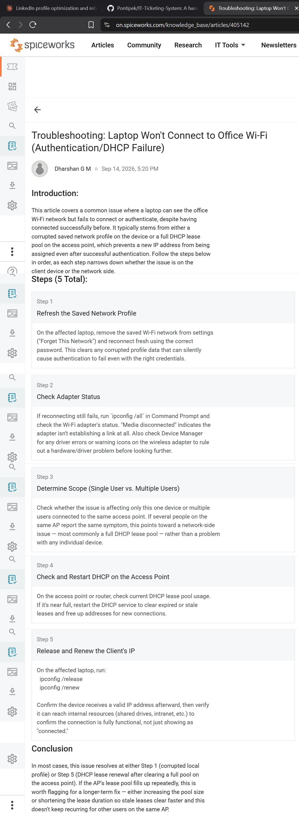
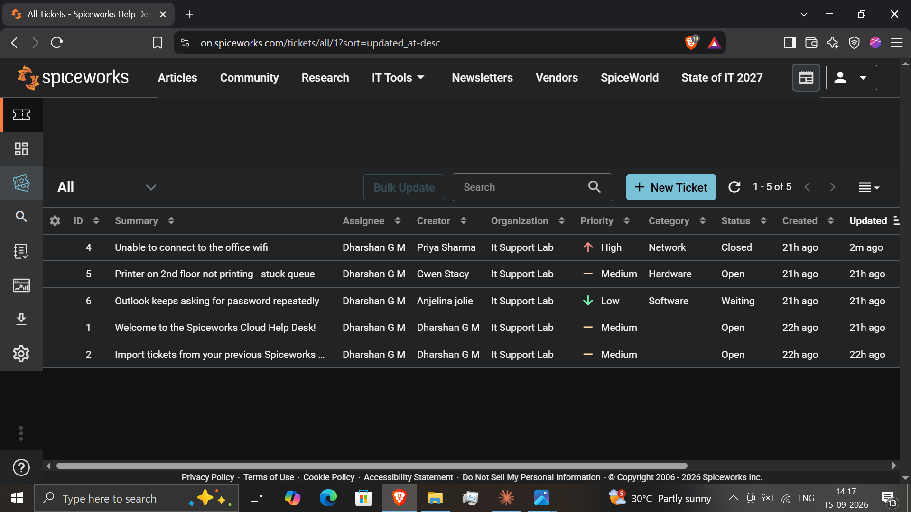

# Self-Hosted / Cloud IT Ticketing System Lab

## Objective
Practice the full ticket lifecycle an L1/L2 technician handles daily: setting up a help desk platform, logging a ticket on behalf of a user, triaging and assigning it, documenting troubleshooting steps through to resolution, and writing a knowledge base article so the fix is reusable by the next technician.

## Environment / Tools
- Spiceworks Cloud Help Desk (spiceworks.com)
- Browser-based technician dashboard and ticketing interface

**Note on tooling:** the lab was originally planned around a self-hosted Peppermint instance via Docker. Docker Desktop on Windows required Hyper-V/WSL2 virtualization support that wasn't enabled, and enabling it risked conflicting with the VirtualBox VMs used in earlier labs. Rather than spend the session on a virtualization/BIOS detour, I switched to Spiceworks Cloud Help Desk — a legitimate, widely used help desk platform in real SMB environments — which let the lab focus on the actual ticketing workflow instead of infrastructure setup.

## What I Did
1. **Platform setup** — Created a Spiceworks Cloud Help Desk organization ("It Support Lab"), set up the account, and reached the technician dashboard.
2. **Ticket creation** — Logged a ticket on behalf of a test requester (Priya Sharma) reporting a Wi-Fi connectivity issue, written as a realistic user complaint including device model and location.
3. **Triage & assignment** — Set the ticket's Category (Network), Priority (High), and assigned it to myself; moved status from Open to Waiting once work began.
4. **Working the ticket** — Added a troubleshooting/resolution comment documenting the diagnosis (DHCP lease pool near-full on the access point) and the fix (restarted DHCP service, released/renewed the client's IP), then closed the ticket.
5. **Knowledge base article** — Wrote a structured KB article ("Troubleshooting: Laptop Won't Connect to Office Wi-Fi") documenting the same issue as a general, reusable guide — Introduction, 5 numbered troubleshooting steps, and a Conclusion — rather than just a ticket recap.
6. **Multi-ticket overview (bonus)** — Logged two additional tickets in different categories and priorities (a Hardware/Medium printer issue, a Software/Low Outlook credential issue) to populate the dashboard with tickets at different stages, alongside the two default onboarding tickets Spiceworks creates automatically.

## Problems I Ran Into
- **Docker virtualization block:** Docker Desktop reported "virtualization support not detected" on Windows. Rather than fight BIOS/Hyper-V/WSL2 configuration that risked destabilizing the VirtualBox VMs from earlier labs, I pivoted to a cloud-hosted help desk tool — a practical call a technician would also make when infrastructure setup is blocking the actual task at hand.
- **Requester field only accepts existing accounts:** Spiceworks' ticket "Requester" field wouldn't take a freeform name — it only populated from existing users/customers on the account. Since "Users" in Spiceworks means technicians (hence only showing up in the *Assign to* dropdown, not as a requester), I created the ticket from the technician side on behalf of the test requester, which is exactly how a lot of real tickets get logged when a technician takes a call or walk-up request directly.
- **Simplified status model:** Spiceworks uses a three-state status system (Open / Waiting / Closed) rather than a more granular Open → In Progress → Resolved → Closed lifecycle. I mapped "Waiting" to represent active work in progress, and used "Closed" to cover both resolution and closure — a small but real example of adapting a planned workflow to how a specific tool actually behaves.

## Screenshots

*Setting up the Spiceworks Cloud Help Desk organization and account.*

*Technician dashboard showing the Open tickets queue.*

*A new ticket logged on behalf of a test requester, reporting a Wi-Fi connectivity issue with device and location details.*

*Ticket triaged with Category, Priority, and Assignee set, status moved to Waiting as work began.*

*Resolution comment documenting the diagnosis and fix, with the ticket moved to Closed status.*

*A structured, reusable KB article documenting the same Wi-Fi issue — Introduction, 5 numbered steps, and a Conclusion.*

*All Tickets view showing 5 tickets across different categories, priorities, and statuses (Open, Waiting, Closed).*

## What This Demonstrates
Demonstrates the day-to-day ticket-handling skills an L1/L2 technician relies on: logging and triaging tickets accurately, documenting a real troubleshooting sequence rather than just closing tickets silently, converting a resolved issue into reusable knowledge base documentation, and adapting a planned workflow when the tooling doesn't match expectations — including making a practical call to switch tools rather than losing time to an infrastructure blocker unrelated to the actual skill being practiced.
