# Active Directory Enterprise Lab (Capstone)

## Objective
Build a small enterprise Active Directory environment from scratch and use it to resolve simulated help desk tickets — the capstone task for this lab series, combining domain administration, Group Policy, PowerShell scripting, and end-to-end troubleshooting into one environment.

## Environment / Tools
- Windows Server 2022 (Domain Controller, `DC01`)
- Active Directory Domain Services (AD DS), DNS, AD CS, File and Storage Services
- Active Directory Users and Computers (ADUC), Group Policy Management Console (GPMC)
- Windows PowerShell (server-side and client-side)
- Windows 11 client VM joined to the domain

## What I Did
1. **Domain Controller deployment** — Installed AD DS, DNS, AD CS, and File and Storage Services roles and promoted the server to a Domain Controller, standing up the `LAB.locol` domain.
2. **Organizational Unit structure** — Created three OUs — `Engineering`, `Management`, and `IT` — to organize users by department rather than leaving everything in the default Users container.
3. **Users, groups, and shared resource permissions** — Created domain users (including Nelson Bighetti and Richard Hendricks in Engineering) and a security group named `EngineeringShare` — named after the shared resource it grants access to rather than the department, matching how permission groups are typically named in real environments. Added both Engineering users and a Management user (Jared Dunn) to the group, reflecting a realistic case of a manager needing access to another team's shared resource.
4. **Group Policy configuration** — Created and linked a GPO (`SetEngineeringBackground`) to the Engineering OU to enforce a department-specific desktop background, and verified it was listed as Enabled under the OU's Linked Group Policy Objects. Confirmed the policy actually applied by checking the desktop background text on a domain-joined client.
5. **PowerShell — scripted user provisioning** — Wrote a parameterized PowerShell script (`Create-ADUser.ps1`) that generates a random password, converts it to a secure string, and creates a new AD user in a specified OU — a reusable script rather than a one-off command, matching how bulk provisioning is actually done. Ran it to create a new user and verified the result with `Get-ADUser`.
6. **PowerShell — password reset** — Reset a user's password via `Set-ADAccountPassword -Reset` and enforced a password change at next logon with `Set-ADUser -ChangePasswordAtLogon $true`, then confirmed the change with `Get-ADUser ... | select name, pass*`.
7. **Domain-joined client verification** — Confirmed the Windows 11 client was joined to `LAB.locol` via `systeminfo | findstr /i "domain"`, and confirmed domain-account login by running `whoami /fqdn` and `whoami /groups` while logged in as a domain user.
8. **Simulated help desk tickets** — Resolved three realistic tickets end-to-end using the environment built above (details below).

## Simulated Help Desk Tickets

**Ticket 1 — Account Lockout**
*Scenario: a user's account triggered a lockout after repeated failed logon attempts and they can no longer sign in.*
Configured and linked an Account Lockout Policy GPO at the domain level, which locked out Richard Hendricks' account after repeated failed logon attempts — reproducing a real lockout rather than simulating one. Resolved it through ADUC's Find Users tool: opened Reset Password on the account, set a new password with "change at next logon" enforced, and checked the "Unlock the user's account" box (visible directly in the same dialog, since ADUC surfaces lockout status right there).

**Ticket 2 — GPO Not Applying / Troubleshooting**
*Scenario: verifying a user's Group Policy is actually in effect and current.*
Ran `gpresult /r` on the client to check applied Group Policy Objects for the logged-in user, confirming both `SetEngineeringBackground` and `LockDesktop` were listed as applied, along with the exact timestamp of last policy application and the user's full security group membership — useful for confirming both *that* a policy applied and *when*, which matters when a user claims a recent policy change hasn't taken effect yet.

**Ticket 3 — Group Membership / Access Request**
*Scenario: a user needs access to the Engineering shared resource.*
Checked the user's current group membership with `Get-ADPrincipalGroupMembership` (showing only the default `Domain Users`), added them to `EngineeringShare` with `Add-ADGroupMember`, then re-ran the membership check to confirm `EngineeringShare` now appeared — a clean before/after sequence proving the fix.

## Problems I Ran Into
- The domain was created as `LAB.locol` instead of `LAB.local` — a typo made at forest creation that then had to be used consistently everywhere afterward (UPNs, `whoami /fqdn`, distinguished names, PowerShell scripts), since renaming a domain after it's live is a disruptive, non-trivial operation in a real environment. Rather than rebuild the entire lab, I treated it the way an admin would in production: leave it and move forward, which is itself a realistic lesson about the cost of a naming mistake this early in a domain's life.
- The Account Lockout Policy GPO only takes effect domain-wide (it can't be scoped to a single OU the way the desktop background GPO could), which meant testing it required understanding domain-level vs. OU-level GPO scope rather than assuming every policy behaves the same way.
- Confirming the desktop background GPO had actually applied wasn't just about checking the GPO's status as "Enabled" in GPMC — the real proof was logging into the client and visually confirming the wallpaper text rendered, since a GPO can show as linked and enabled without necessarily having applied correctly to a specific client yet.

## Screenshots
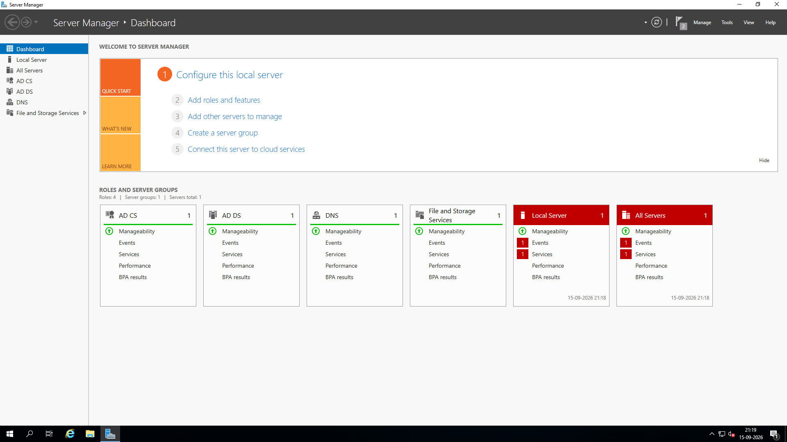
*Server Manager showing AD DS, AD CS, DNS, and File and Storage Services roles installed after promoting the server to a Domain Controller.*

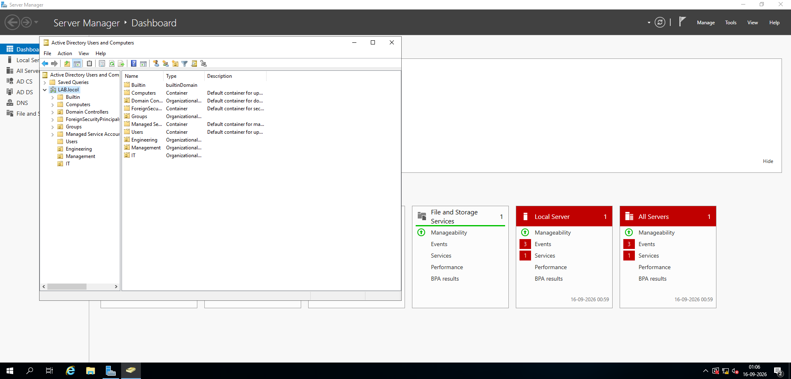
*Active Directory Users and Computers showing the Engineering, Management, and IT Organizational Units.*

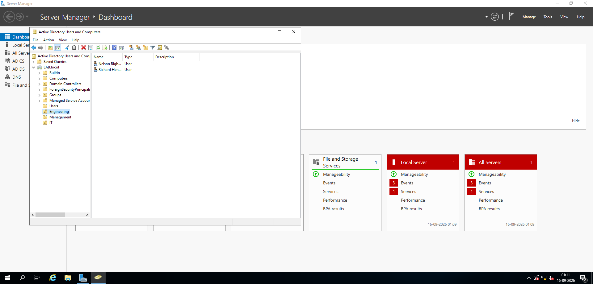
*Domain user accounts (Nelson Bighetti, Richard Hendricks) organized inside the Engineering OU.*

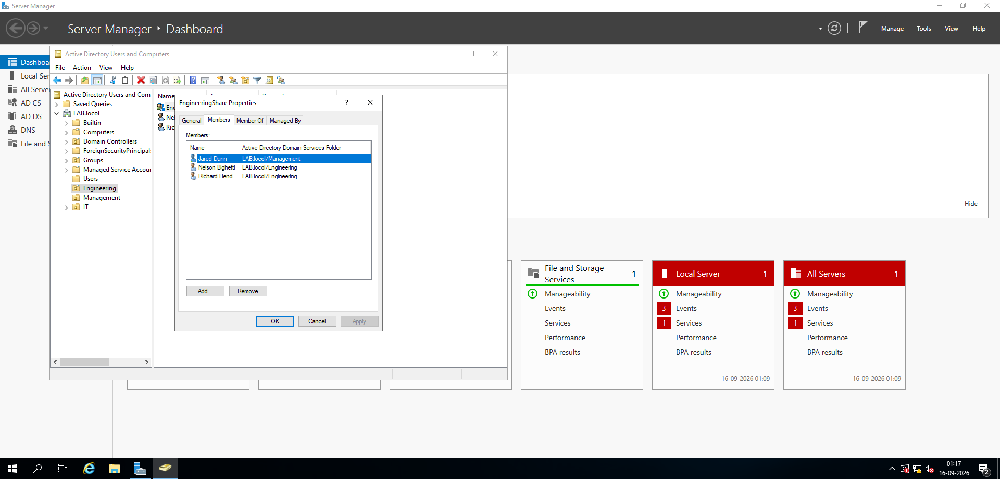
*EngineeringShare security group membership, including Engineering users and a Management user with shared access.*

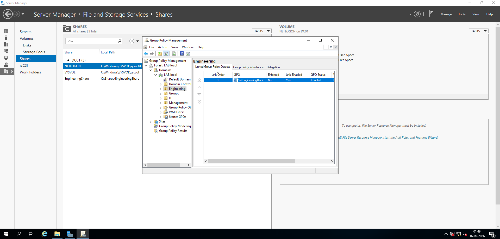
*The Engineering shared folder and the SetEngineeringBackground GPO linked and enabled on the Engineering OU.*

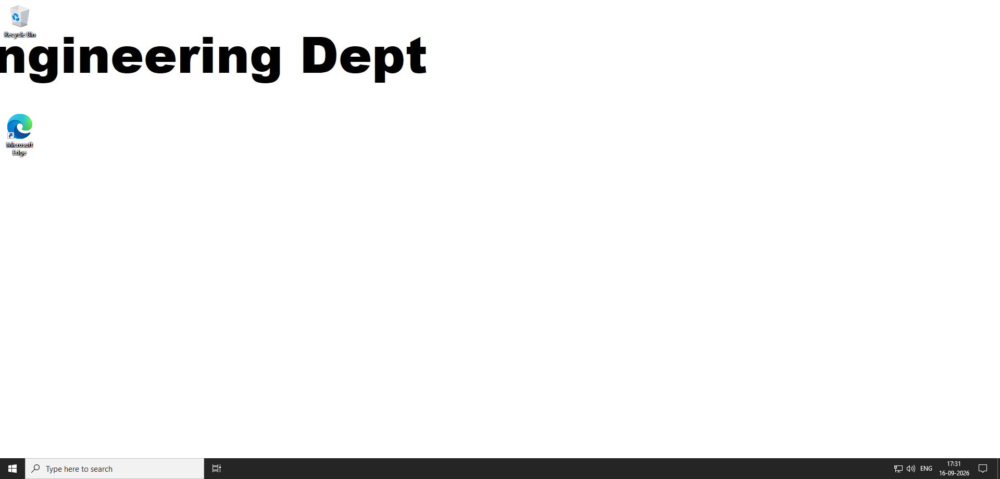
*Desktop background policy confirmed applied on a domain-joined client.*

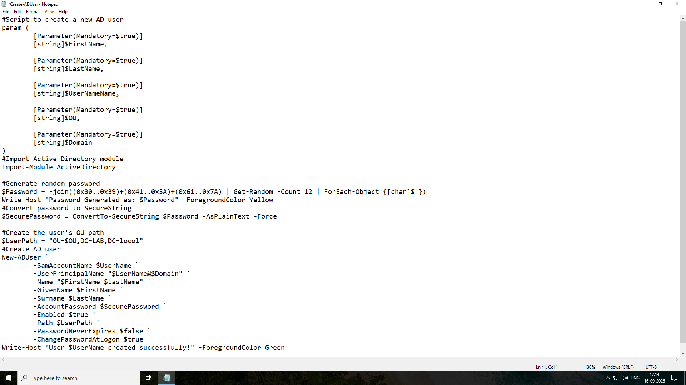
*Create-ADUser.ps1 — a parameterized script for scripted user provisioning with random password generation.*

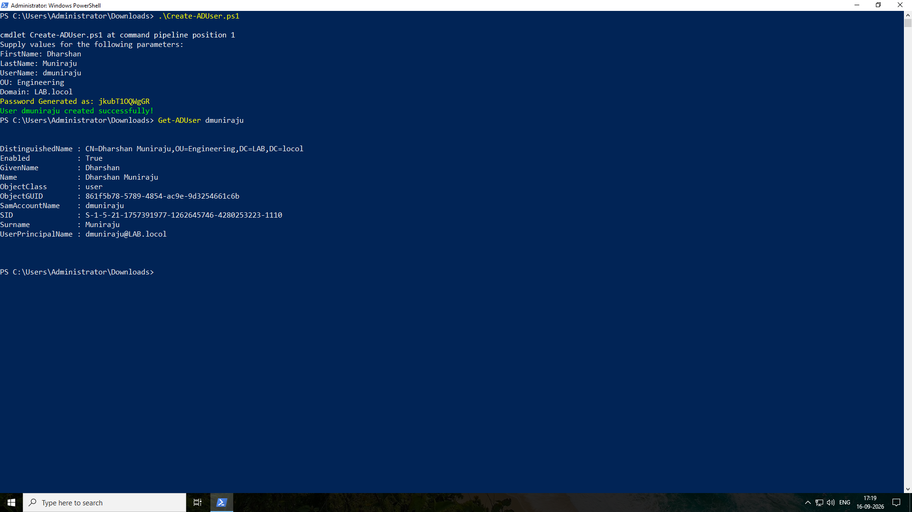
*Running the provisioning script and verifying the new user with Get-ADUser.*

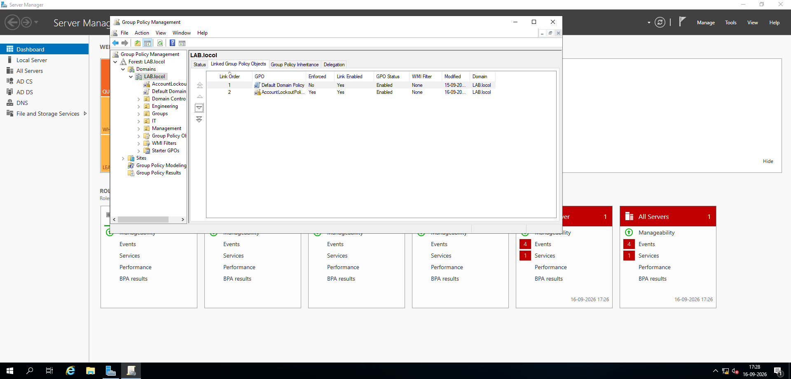
*Account Lockout Policy GPO linked at the domain level.*

*Real account lockout triggered on the client after repeated failed logon attempts.*

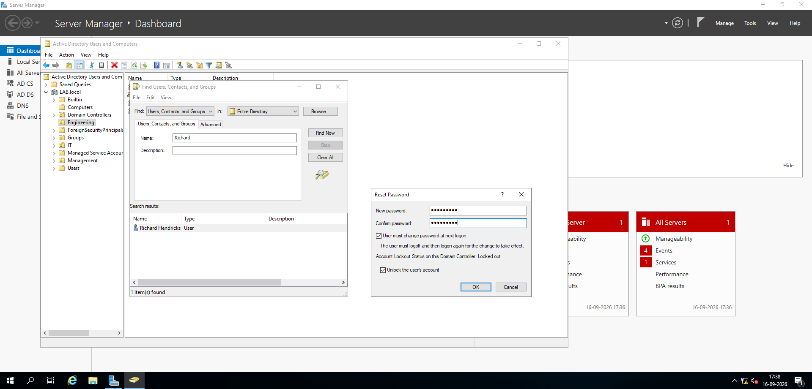
*Resolving the lockout via ADUC: password reset with the Unlock account option checked.*

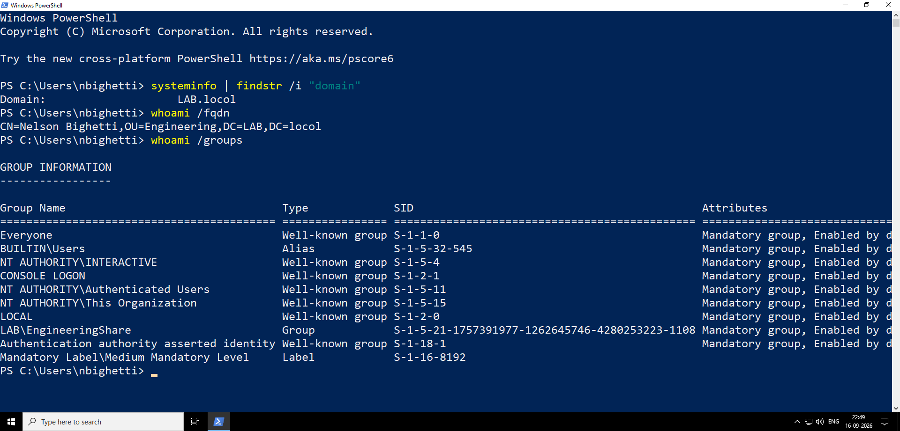
*systeminfo and whoami /fqdn confirming the client is domain-joined and authenticated as a domain user.*

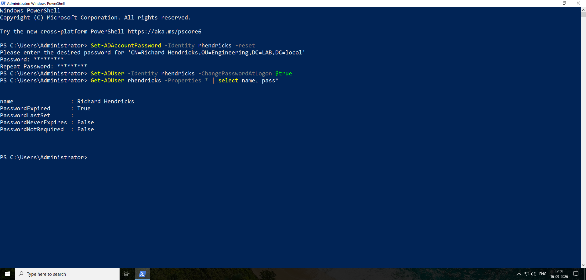
*Resetting a user's password via PowerShell and confirming the change with Get-ADUser.*

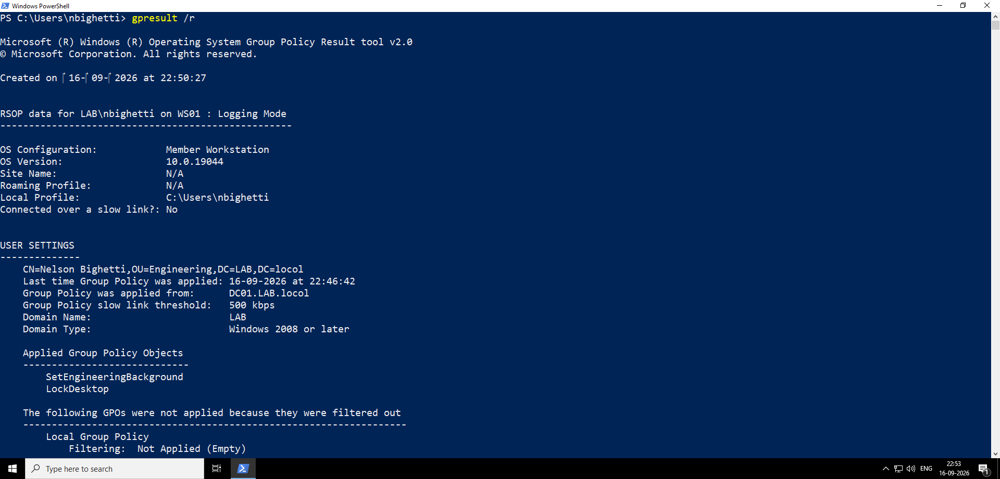
*gpresult /r showing applied Group Policy Objects and their last-applied timestamp.*

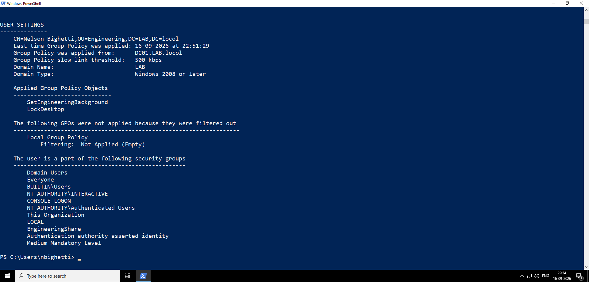
*Continued gpresult /r output showing the user's full security group membership.*

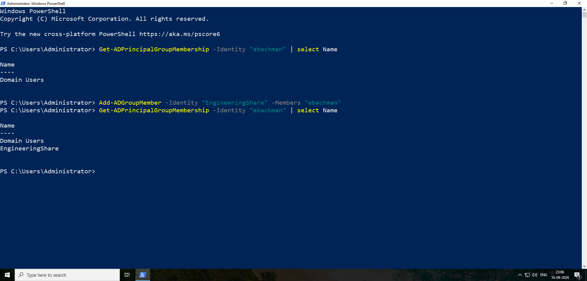
*Before/after Get-ADPrincipalGroupMembership output showing a user added to EngineeringShare via Add-ADGroupMember.*

## What This Demonstrates
Demonstrates end-to-end Active Directory administration: deploying a Domain Controller, structuring an OU hierarchy, provisioning users and groups both through the GUI and via reusable PowerShell scripts, enforcing policy through Group Policy, verifying domain authentication on a client, and resolving realistic help desk tickets — account lockouts, policy application issues, and access requests — using the same tools and commands a Tier 1/2 sysadmin relies on daily. It also reflects the reality of working in an existing environment with an inherited naming mistake, rather than a clean lab built with no friction.
